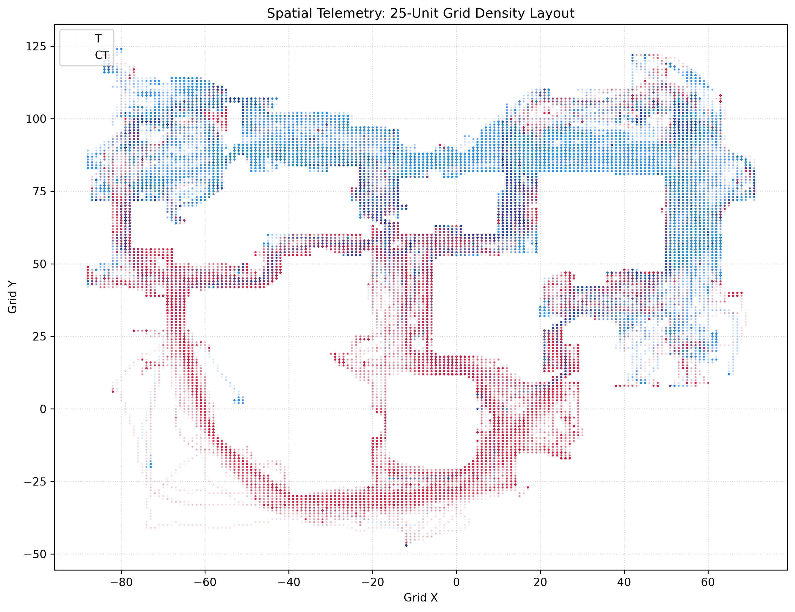

# cs-hivemind-tactical-engine
A multi-layered tactical data engine optimizing continuous 3D spatial telemetry into a discrete 2.5D coordinate matrix and predictive sequence model

Traditional game AI uses heavy 3D physics loops and Ray-tracing lines of sight. This engine bypasses that by preprocessing a 3D map space into a light, flat mathematical matrix:

25-Unit Grid Cells: Breaks the infinite 3D coordinate space down into uniform bounding boxes to cleanly map player positions without continuous float data bloat.

Pre-Baked PVS (Potentially Visible Set): A static visibility lookup table. The engine calculates who can see who before the simulation runs, changing live field-of-view checks into instant matrix queries.

Hierarchical Loop: A Manager-Worker model where a high-level strategic bot assigns team paths on the grid, and local behavior-cloning models handle smooth path tracking, angle holds, and utility placement.

Project Roadmap:
This repository is currently an active work-in-progress targeting a baseline simulation framework:

Architecture Planning and Repository Setup

Data Pipeline voxel_grid.py: Python script utilizing NumPy and Pandas to discretize raw spatial telemetry coordinates into localized grid indices.

Data Visualization: Matplotlib generator to map matrix cells into 2D spatial overlays for analysis.

Pre-computed Visibility Table: Storing spatial relationships in a compressed JSON index.

Model Skeleton: A PyTorch training loop blueprint tracking state-transitions across simulation ticks.

Dev Tech Stack
Language: Python 3

Data Libraries: NumPy, Pandas, Matplotlib

Core Frameworks: PyTorch, Docker for Headless Server Environments

